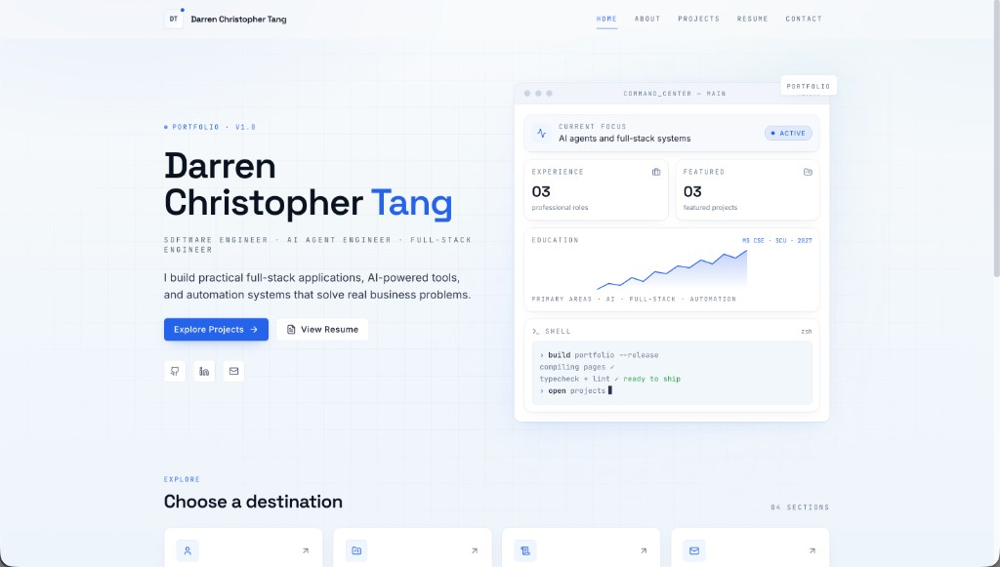
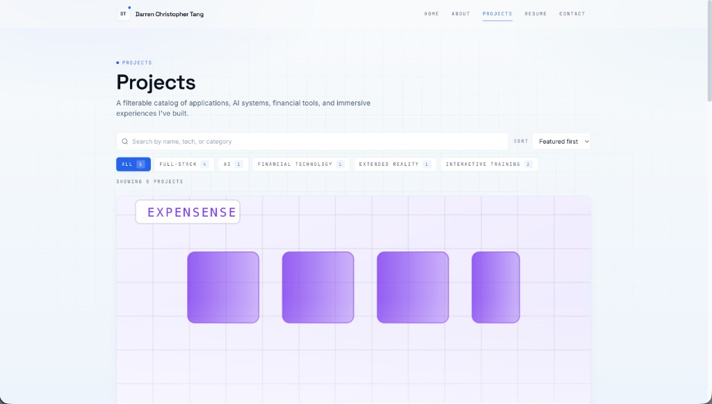
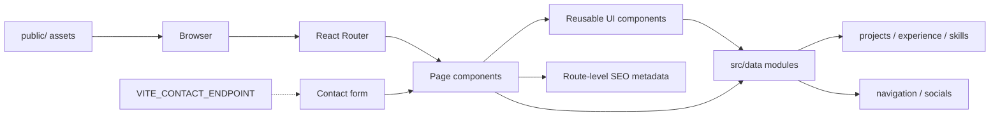

# Darren Tang Portfolio

A recruiter-facing, multi-page software engineering portfolio for Darren Christopher Tang. It presents professional experience, skills, selected projects with case studies, and résumé information in a clear, navigable site. The app is built as a static frontend that can be deployed to common hosting platforms.

## Project Overview

- **Home** — Introduction, section navigation, and featured projects with links to case studies.
- **About** — Background, education and career highlights, experience timeline, and skills.
- **Projects** — Filterable project gallery with search and sort, plus individual case-study routes.
- **Résumé** — Embedded PDF viewer with download support.
- **Contact** — Contact form and social links.

The layout is responsive, with mobile navigation and accessibility-minded markup (semantic landmarks, skip link, labeled controls, and focus management). Motion respects `prefers-reduced-motion` via Framer Motion and CSS. Portfolio content is driven from modules under `src/data/`.

## Project Preview

Screenshots of the main recruiter-facing areas of the portfolio.

### Home



The home page introduces my software engineering focus and provides direct access to projects and my résumé.

### Projects



The project gallery supports searching, category filtering, sorting, and access to individual project case studies.

### About


The About page presents my background, education, professional experience, and technical focus.

## Project Architecture



Static images and the résumé PDF are served from `public/`. Project, experience, skills, navigation, and social content live in `src/data/`. Each route sets SEO metadata through the shared SEO component. The optional contact form endpoint is configured with `VITE_CONTACT_ENDPOINT`.

Content is separated from presentation so portfolio information can be updated in the data modules without rewriting component markup.

## Tech Stack

| Area | Technology |
| --- | --- |
| UI | React, TypeScript |
| Build | Vite |
| Routing | React Router |
| Styling | Tailwind CSS |
| Motion | Framer Motion |
| SEO | React Helmet Async |
| Icons | Lucide React |
| Quality | ESLint |

## Getting Started

```bash
git clone https://github.com/tangdarren/portfolio.git
cd portfolio
npm install
cp .env.example .env.local
npm run dev
```

Copying `.env.example` to `.env.local` is optional unless you are configuring the contact endpoint (or other documented Vite variables). The Vite dev server runs at [http://localhost:5173](http://localhost:5173).

## Available Scripts

| Command | Description |
| --- | --- |
| `npm run dev` | Start the Vite development server |
| `npm run build` | Type-check and create a production build in `dist/` |
| `npm run preview` | Preview the production build locally |
| `npm run typecheck` | Run TypeScript checks without emitting output |
| `npm run lint` | Run ESLint |
| `npm test` | Run the Vitest suite once |
| `npm run test:watch` | Run Vitest in watch mode |

## Environment Configuration

| Variable | Purpose |
| --- | --- |
| `VITE_CONTACT_ENDPOINT` | Optional URL the contact form POSTs to (JSON body: `name`, `email`, `subject`, `message`) |
| `VITE_SITE_URL` | Optional public site origin for canonical URLs, Open Graph/Twitter images, `robots.txt`, and `sitemap.xml` |

When `VITE_CONTACT_ENDPOINT` is unset, the form still validates input, then opens a `mailto:` link to `tang.darren@gmail.com` with the submitted subject and message. It does not claim a server-side send succeeded.

Do not put secret API keys in frontend `VITE_*` variables. Use a public or publishable endpoint, or a backend proxy that keeps secrets server-side.

## Deployment

`npm run build` outputs a static site to `dist/`. The repository includes SPA routing configuration for Vercel (`vercel.json`) and Netlify (`netlify.toml` and `public/_redirects`).
